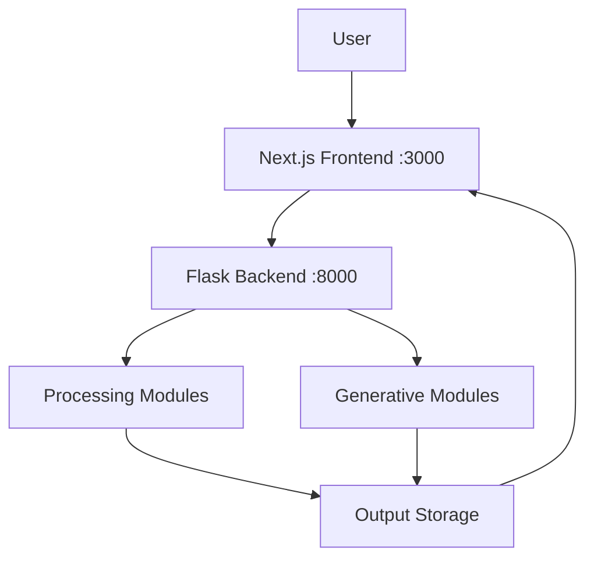

# 🚀 AIVERSE — AI-Powered Image Intelligence Platform 

# (🚧 Under Development)

<p align="center">
  <b>One Platform • Infinite AI Possibilities</b><br>
  Unified system for Computer Vision & Generative AI
</p>

---

## 📌 Overview

**AIVERSE** is a **full-stack AI image intelligence platform** that combines multiple computer vision and generative AI capabilities into a single unified dashboard.

It enables users to **restore, enhance, detect, recognize, and generate images** seamlessly — all in one place.

---

## ✨ Features

* 🧼 **Image Restoration** — Richardson–Lucy + DeblurGAN-v2
* ✨ **Image Enhancement** — CLAHE + sharpening
* 🎯 **Object Detection** — YOLOv8 bounding boxes
* 🧠 **Image Recognition** — Top-5 classification
* 🎨 **Text-to-Image** — Stable Diffusion
* 🔁 **Image-to-Image** — Prompt-based transformation
* ✏️ **Sketch-to-Image** — ControlNet
* 🎥 **Video Restoration** — Frame-by-frame processing
* 📂 **Output Vault** — Manage results
* 🔍 **Diff Overlay** — Visual comparison

---

## 🏗️ Architecture



---

## 🧰 Tech Stack

### Backend

* Python 3.10
* Flask, Flask-CORS
* OpenCV, NumPy, Pillow
* PyTorch, Diffusers, Transformers
* Ultralytics YOLOv8

### Frontend

* Next.js 16 (React 19)
* Tailwind CSS v4
* Framer Motion
* TypeScript

---

## 📁 Project Structure

```bash
AIVERSE/
├── app.py
├── config.py
├── requirements.txt
├── .env
│
├── processing/
├── generative/
├── vision_utils/
├── models/
├── trained_model/
│
├── static/
│   ├── uploads/
│   └── outputs/
│
├── frontend/
├── scripts/
└── docs/
```

---

## ⚙️ Prerequisites

* Anaconda / Miniconda
* Node.js (v18+)
* Git

> ⚠️ Recommended: 16GB RAM + GPU for generative features

---

## 🛠️ Installation

### 1️⃣ Clone Repository

```bash
git clone <repo-url>
cd AIVERSE
```

### 2️⃣ Create Environment

```bash
conda create -n aiverse python=3.10 -y
conda activate aiverse
```

### 3️⃣ Install Backend Dependencies

```bash
pip install -r requirements.txt
```

### 4️⃣ Setup Environment Variables

Create `.env` file:

```ini
HF_TOKEN=your_huggingface_token
```

### 5️⃣ Install Frontend

```bash
cd frontend
npm install
cd ..
```

---

## ▶️ Running the Application

### 🔹 Option A (Recommended)

```bash
.\scripts\dev.ps1
```

### 🔹 Option B (Manual)

**Terminal 1 — Backend**

```bash
conda activate aiverse
python app.py
```

**Terminal 2 — Frontend**

```bash
cd frontend
npm run dev
```

👉 Open: [http://localhost:3000](http://localhost:3000)

---

## 🔗 API Endpoints

| Method | Endpoint         | Description              |
| ------ | ---------------- | ------------------------ |
| GET    | `/api/health`    | Check backend status     |
| POST   | `/api/process`   | Main processing endpoint |
| POST   | `/api/job/start` | Start async job          |
| GET    | `/api/job/<id>`  | Job status               |
| GET    | `/api/vault`     | Fetch outputs            |

---

## 🧠 Processing Pipeline

* Preprocessing (denoise / derain)
* PSF estimation
* Richardson–Lucy deconvolution
* Enhancement (CLAHE + sharpening)
* Output + diff visualization

---

## 🎨 Generative AI

* Stable Diffusion (Diffusers)
* ControlNet (Sketch-to-Image)
* Text → Image
* Image → Image

---

## 🧪 Troubleshooting

| Issue                 | Solution                            |
| --------------------- | ----------------------------------- |
| Backend not starting  | Activate conda env + reinstall deps |
| Frontend not fetching | Ensure backend is running           |
| Model download fails  | Check `HF_TOKEN`                    |
| Port conflict         | Free ports 3000 / 8000              |

---

## 🔐 Environment Variables

| Variable | Description        |
| -------- | ------------------ |
| HF_TOKEN | Hugging Face token |

---

## ⚡ Quick Start

```bash
conda create -n aiverse python=3.10 -y
conda activate aiverse
pip install -r requirements.txt
cd frontend && npm install && cd ..
.\scripts\dev.ps1
```

---

## 📸 Demo (Optional)

> Add screenshots / GIFs here for better GitHub engagement

---

## 🤝 Contributing

Contributions are welcome!
Feel free to open issues or submit pull requests.


